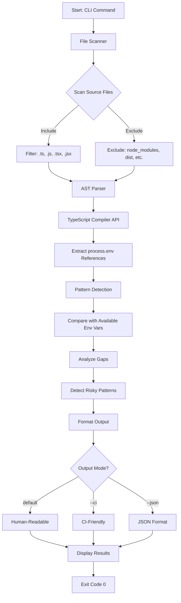
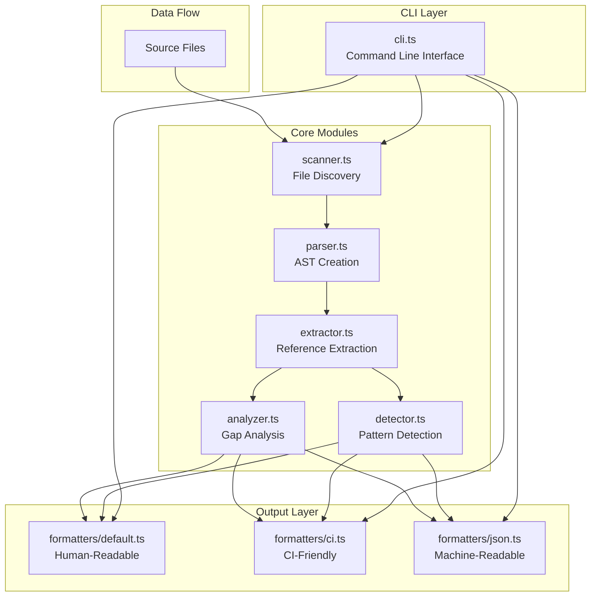

# Envwatch

> **CI‑first environment variable visibility for Node.js projects**  
> Detect missing, unused, and risky environment variables *before* they break builds or production.

[](https://www.npmjs.com/package/envwatch)
[](https://nodejs.org/)

---

## Table of Contents

- [The Problem](#the-problem)
- [Why Envwatch?](#why-envwatch)
- [What Problems Does It Solve?](#what-problems-does-it-solve)
- [How It Works](#how-it-works)
- [Installation](#installation)
- [Quick Start](#quick-start)
- [Usage Examples](#usage-examples)
- [Output Formats](#output-formats)
- [Features Explained](#features-explained)
- [CI/CD Integration](#cicd-integration)
- [Testing & Examples](#testing--examples)
- [Architecture](#architecture)
- [Comparison with Other Tools](#comparison-with-other-tools)
- [Development](#development)
- [Contributing](#contributing)
- [Roadmap](#roadmap)

---

## The Problem

### Real-World Scenarios

**Scenario 1: The Silent CI Failure**
```javascript
// src/config.js
const apiKey = process.env.API_KEY;  // Used in code

// .github/workflows/ci.yml
# Missing API_KEY in CI environment
# Build passes locally but fails in CI
```

**Scenario 2: Configuration Drift**
```javascript
// Old code removed DATABASE_URL usage
// But DATABASE_URL still exists in:
// - .env files
// - CI environment variables
// - Production secrets manager
// Nobody knows it's unused anymore
```

**Scenario 3: Risky Patterns**
```javascript
// Dangerous: Hardcoded fallback masks missing env var
const port = process.env.PORT || 3000;  // Works locally, fails in production

// Dangerous: NODE_ENV override
process.env.NODE_ENV = 'development';  // Overrides CI settings
```

### The Core Issues

1. **Visibility Gap**: No clear view of which env vars are actually used vs. configured
2. **Environment Mismatch**: Local, CI, and production environments drift apart
3. **Late Detection**: Configuration issues surface only when builds fail or production breaks
4. **Maintenance Burden**: Unused env vars accumulate, creating confusion and security risks
5. **Risky Patterns**: Hardcoded fallbacks and overrides hide configuration problems

---

## Why Envwatch?

Environment variables are one of the **most fragile parts** of modern applications. They're:
- **Invisible** until something breaks
- **Scattered** across code, config files, and CI settings
- **Environment-specific** with no easy way to compare
- **Prone to drift** as code evolves

### What Makes Envwatch Different?

| Traditional Approach | Envwatch Approach |
|---------------------|-------------------|
| Manual documentation | Automatic discovery |
| Runtime errors | Static analysis |
| Environment-specific checks | Cross-environment comparison |
| Reactive debugging | Proactive detection |
| No visibility | Clear, actionable reports |

---

## What Problems Does It Solve?

### ✅ Problem 1: Missing Environment Variables

**Before Envwatch:**
- Developer commits code using `process.env.NEW_FEATURE_KEY`
- Code works locally (has `.env` file)
- CI fails with cryptic error: `undefined is not a function`
- Developer spends hours debugging

**With Envwatch:**
```bash
$ npx envwatch --ci
=== Envwatch Analysis ===

Missing: 1 environment variable
  - NEW_FEATURE_KEY

Action: Review environment variable configuration
```
**Result**: Issue detected in PR, fixed before merge.

### ✅ Problem 2: Unused Environment Variables

**Before Envwatch:**
- Team has 50+ env vars configured
- 20 are from old features, no longer used
- New team members don't know which are safe to remove
- Security risk: unused vars might contain sensitive data

**With Envwatch:**
```bash
$ npx envwatch
🌱 Environment Variable Summary

• 30 env vars referenced in code
• 20 unused env vars detected
  - OLD_FEATURE_KEY
  - DEPRECATED_API_URL
  - ...
```
**Result**: Clean up unused vars, reduce attack surface.

### ✅ Problem 3: Risky Configuration Patterns

**Before Envwatch:**
```javascript
// This code works locally but fails in production
const port = process.env.PORT || 3000;
const dbUrl = process.env.DATABASE_URL || 'localhost';
```
- Hardcoded fallbacks mask missing env vars
- Production failures are hard to diagnose

**With Envwatch:**
```bash
⚠️ 2 risky patterns detected
  [HARDCODED_FALLBACK] Hardcoded fallback value detected: 3000
    Location: src/config.ts:5:12
  [HARDCODED_FALLBACK] Hardcoded fallback value detected: 'localhost'
    Location: src/config.ts:6:15
```
**Result**: Identify risky patterns before they cause production issues.

### ✅ Problem 4: Configuration Drift

**Before Envwatch:**
- Local `.env` has 30 vars
- CI has 25 vars
- Production has 28 vars
- No way to know what's missing or extra

**With Envwatch:**
- Run in each environment
- Compare outputs
- Identify drift immediately

---

## How It Works

Envwatch uses **static analysis** to understand your codebase without executing it. Here's the complete flow:

> **Visual Diagram**: See [envwatch-flow-diagram.png](docs/envwatch-flow-diagram.png) for a detailed visual representation of the process.



### Step-by-Step Process

1. **File Discovery**: Recursively scans your project for source files
   - Supports: `.ts`, `.tsx`, `.js`, `.jsx`, `.mjs`, `.cjs`
   - Excludes: `node_modules`, `.git`, `dist`, build directories

2. **AST Parsing**: Uses TypeScript Compiler API to parse files
   - Creates Abstract Syntax Tree (AST) for each file
   - No code execution required

3. **Reference Extraction**: Finds all `process.env.*` patterns
   - `process.env.VAR_NAME` (dot notation)
   - `process.env['VAR_NAME']` (bracket notation)
   - Tracks file location (line, column)

4. **Analysis**: Compares references with available environment variables
   - **Missing**: Referenced but not available
   - **Unused**: Available but not referenced

5. **Pattern Detection**: Identifies risky configurations
   - NODE_ENV overrides
   - Hardcoded fallbacks

6. **Output Generation**: Formats results based on mode

---

## Installation

### Quick Install (Recommended)

No installation needed - run directly with npx:

```bash
npx envwatch
```

### Local Installation

For projects that want to pin a version:

```bash
npm install --save-dev envwatch
```

Then add to your `package.json` scripts:

```json
{
  "scripts": {
    "env:check": "envwatch",
    "env:check:ci": "envwatch --ci"
  }
}
```

### Requirements

- **Node.js**: >= 18.0.0
- **TypeScript**: Not required (tool uses TypeScript Compiler API internally)

---

## Quick Start

### 1. Run in Your Project

```bash
cd your-project
npx envwatch
```

### 2. Review the Output

```
🌱 Environment Variable Summary

• 14 env vars referenced in code
• 3 missing
• 4 unused env vars detected
• ⚠️ 1 risky pattern detected

Review recommended
```

### 3. Fix Issues

- Add missing env vars to your CI/production environment
- Remove unused env vars
- Review risky patterns

### 4. Integrate into CI

Add to your CI workflow (see [CI/CD Integration](#cicd-integration))

---

## Usage Examples

### Example 1: Local Development Check

```bash
# Check current project
$ npx envwatch

🌱 Environment Variable Summary

• 8 env vars referenced in code
• 2 missing
  - DATABASE_URL
  - API_SECRET
• 5 unused env vars detected
  - OLD_FEATURE_FLAG
  - DEPRECATED_KEY
  - ...

Review recommended
```

### Example 2: CI Integration

```bash
# In GitHub Actions
$ npx envwatch --ci

=== Envwatch Analysis ===

Referenced: 8 environment variables
Missing: 2 environment variables
  - DATABASE_URL
  - API_SECRET

Action: Review environment variable configuration
```

### Example 3: JSON Output for Automation

```bash
$ npx envwatch --json | jq '.summary'

{
  "referencedCount": 8,
  "missingCount": 2,
  "unusedCount": 5,
  "riskyCount": 1
}
```

### Example 4: Custom Path Analysis

```bash
# Analyze specific directory
$ npx envwatch --path ./src

# Exclude patterns
$ npx envwatch --exclude tests --exclude dist
```

### Example 5: Real-World Project

```bash
# In a Next.js project
$ npx envwatch

🌱 Environment Variable Summary

• 12 env vars referenced in code
• 0 missing
• 3 unused env vars detected
  - NEXT_PUBLIC_OLD_API
  - LEGACY_DB_URL
• ⚠️ 2 risky patterns detected
  [HARDCODED_FALLBACK] Hardcoded fallback: 'development'
    Location: src/config.ts:15:8
  [NODE_ENV_OVERRIDE] NODE_ENV is being overridden
    Location: src/utils/env.ts:22:1

Review recommended
```

---

## Output Formats

### Default Mode (Human-Readable)

Best for local development and quick checks:

```bash
$ npx envwatch
```

**Output:**
```
🌱 Environment Variable Summary

• 14 env vars referenced in code
• 3 missing in CI
• 4 unused env vars detected
• ⚠️ 1 risky pattern detected (NODE_ENV overridden)

Review recommended
```

### CI Mode (`--ci`)

Optimized for CI/CD logs - no emojis, structured format:

```bash
$ npx envwatch --ci
```

**Output:**
```
=== Envwatch Analysis ===

Referenced: 14 environment variables
Missing: 3 environment variables
  - DATABASE_URL
  - API_KEY
  - SECRET_TOKEN

Unused: 4 environment variables
  - OLD_FEATURE_FLAG
  - DEPRECATED_KEY
  - ...

Risky Patterns: 1
  [NODE_ENV_OVERRIDE] NODE_ENV is being overridden
    Location: src/config.ts:10:5

Action: Review environment variable configuration
```

### JSON Mode (`--json`)

Machine-readable output for automation and tooling:

```bash
$ npx envwatch --json
```

**Output:**
```json
{
  "referenced": [
    {
      "name": "DATABASE_URL",
      "file": "src/config.ts",
      "line": 5,
      "column": 20
    },
    {
      "name": "API_KEY",
      "file": "src/api.ts",
      "line": 12,
      "column": 15
    }
  ],
  "missing": [
    "DATABASE_URL",
    "API_KEY"
  ],
  "unused": [
    "OLD_FEATURE_FLAG",
    "DEPRECATED_KEY"
  ],
  "risky": [
    {
      "type": "NODE_ENV_OVERRIDE",
      "description": "NODE_ENV is being overridden",
      "location": "src/config.ts:10:5",
      "file": "src/config.ts",
      "line": 10,
      "column": 5
    }
  ],
  "summary": {
    "referencedCount": 14,
    "missingCount": 3,
    "unusedCount": 4,
    "riskyCount": 1
  }
}
```

---

## Features Explained

### 🔍 Referenced Environment Variables

**What it does**: Scans your codebase and finds all places where `process.env.*` is used.

**Why it matters**: 
- Creates a complete inventory of required env vars
- Helps onboard new team members
- Documents configuration needs

**Example Detection:**
```typescript
// Detects all these patterns:
const apiKey = process.env.API_KEY;           // ✅ Detected
const dbUrl = process.env['DATABASE_URL'];    // ✅ Detected
const port = process.env.PORT || 3000;        // ✅ Detected (with risk warning)
```

### ❌ Missing Environment Variables

**What it does**: Compares referenced vars with currently available env vars.

**Why it matters**:
- Prevents runtime errors
- Catches configuration gaps early
- Ensures CI/production readiness

**Example:**
```bash
# Code references API_KEY but it's not set
Missing: 1 environment variable
  - API_KEY
```

### 🧹 Unused Environment Variables

**What it does**: Identifies env vars that are configured but never referenced in code.

**Why it matters**:
- Reduces security surface area
- Cleans up obsolete configuration
- Prevents confusion about what's needed

**Example:**
```bash
# OLD_FEATURE_FLAG exists in .env but code doesn't use it
Unused: 1 environment variable
  - OLD_FEATURE_FLAG
```

### ⚠️ Risky Patterns

**What it detects**:

1. **NODE_ENV Overrides**
   ```typescript
   // Risky: Overrides environment setting
   process.env.NODE_ENV = 'development';
   ```
   **Why risky**: Can mask production vs development differences, leading to bugs.

2. **Hardcoded Fallbacks**
   ```typescript
   // Risky: Fallback hides missing env var
   const port = process.env.PORT || 3000;
   const dbUrl = process.env.DATABASE_URL || 'localhost';
   ```
   **Why risky**: Code works locally but fails silently in production when env var is missing.

**Example Output:**
```bash
⚠️ 2 risky patterns detected
  [HARDCODED_FALLBACK] Hardcoded fallback value detected: 3000
    Location: src/config.ts:5:12
  [NODE_ENV_OVERRIDE] NODE_ENV is being overridden
    Location: src/utils/env.ts:22:1
```

---

## CI/CD Integration

### GitHub Actions

```yaml
name: Environment Variable Check

on:
  pull_request:
  push:
    branches: [main]

jobs:
  envwatch:
    runs-on: ubuntu-latest
    steps:
      - uses: actions/checkout@v3
      
      - name: Setup Node.js
        uses: actions/setup-node@v3
        with:
          node-version: '18'
      
      - name: Run Envwatch
        run: npx envwatch --ci
        env:
          # Your CI environment variables here
          DATABASE_URL: ${{ secrets.DATABASE_URL }}
          API_KEY: ${{ secrets.API_KEY }}
```

### GitLab CI

```yaml
envwatch:
  image: node:18
  script:
    - npx envwatch --ci
  variables:
    DATABASE_URL: $DATABASE_URL
    API_KEY: $API_KEY
```

### CircleCI

```yaml
jobs:
  envwatch:
    docker:
      - image: cimg/node:18.0
    steps:
      - checkout
      - run: npx envwatch --ci
      - run:
          name: Store results
          command: npx envwatch --json > envwatch-results.json
          when: always
```

### Jenkins

```groovy
pipeline {
    agent any
    stages {
        stage('Envwatch') {
            steps {
                sh 'npx envwatch --ci'
            }
        }
    }
}
```

---

## Testing & Examples

### Unit Test Examples

Envwatch includes comprehensive unit tests. Here are examples of what's tested:

#### Example 1: Scanner Tests

Tests that the file scanner correctly discovers source files:

```typescript
// tests/unit/scanner.test.ts
test('scanner should scan TypeScript and JavaScript files', () => {
  const files = scanSourceFiles({ path: fixturesPath });
  assert.ok(files.length > 0);
  assert.ok(files.some((f) => f.endsWith('.ts')));
  assert.ok(files.some((f) => f.endsWith('.js')));
});

test('scanner should exclude node_modules', () => {
  const files = scanSourceFiles({ path: process.cwd() });
  assert.ok(files.every((f) => !f.includes('node_modules')));
});
```

#### Example 2: Extractor Tests

Tests that environment variable references are correctly extracted:

```typescript
// tests/unit/extractor.test.ts
test('extractor should extract process.env references', () => {
  const files = [path.join(fixturesPath, 'sample-code.ts')];
  const parsedFiles = parseFiles(files);
  const references = extractEnvReferences(parsedFiles);

  assert.ok(references.length > 0);
  assert.ok(references.some((r) => r.name === 'API_KEY'));
  assert.ok(references.some((r) => r.name === 'DATABASE_URL'));
  assert.ok(references.some((r) => r.name === 'NODE_ENV'));
});
```

**Test Fixture (`tests/fixtures/sample-code.ts`):**
```typescript
// Sample code file for testing
const apiKey = process.env.API_KEY;
const dbUrl = process.env['DATABASE_URL'];
const nodeEnv = process.env.NODE_ENV || 'development';

// Risky pattern: NODE_ENV override
process.env.NODE_ENV = 'production';

// Risky pattern: hardcoded fallback
const port = process.env.PORT || 3000;
const debug = process.env.DEBUG || false;

export { apiKey, dbUrl, nodeEnv, port, debug };
```

#### Example 3: Analyzer Tests

Tests that missing and unused variables are correctly identified:

```typescript
// tests/unit/analyzer.test.ts
test('analyzer should detect missing environment variables', () => {
  const references: EnvReference[] = [
    { name: 'EXISTING_VAR', file: 'test.ts', line: 1, column: 1 },
    { name: 'MISSING_VAR', file: 'test.ts', line: 2, column: 1 },
  ];

  const available = ['EXISTING_VAR', 'OTHER_VAR'];
  const { missing, unused } = analyzeEnvVars(references, available);

  assert.ok(missing.includes('MISSING_VAR'));
  assert.ok(!missing.includes('EXISTING_VAR'));
});

test('analyzer should detect unused environment variables', () => {
  const references: EnvReference[] = [
    { name: 'USED_VAR', file: 'test.ts', line: 1, column: 1 },
  ];

  const available = ['USED_VAR', 'UNUSED_VAR'];
  const { missing, unused } = analyzeEnvVars(references, available);

  assert.ok(unused.includes('UNUSED_VAR'));
  assert.ok(!unused.includes('USED_VAR'));
});
```

#### Example 4: Detector Tests

Tests that risky patterns are correctly detected:

```typescript
// tests/unit/detector.test.ts
test('detector should detect NODE_ENV overrides', () => {
  const files = [path.join(fixturesPath, 'sample-code.ts')];
  const parsedFiles = parseFiles(files);
  const patterns = detectRiskyPatterns(parsedFiles);

  const nodeEnvOverride = patterns.find(
    (p) => p.type === 'NODE_ENV_OVERRIDE',
  );
  assert.ok(nodeEnvOverride !== undefined);
});

test('detector should detect hardcoded fallbacks', () => {
  const files = [path.join(fixturesPath, 'sample-code.ts')];
  const parsedFiles = parseFiles(files);
  const patterns = detectRiskyPatterns(parsedFiles);

  const fallbacks = patterns.filter(
    (p) => p.type === 'HARDCODED_FALLBACK',
  );
  assert.ok(fallbacks.length > 0);
});
```

### Running Tests

```bash
# Run all tests
npm test

# Run with coverage (if configured)
npm run test:coverage

# Run specific test file
node --test dist/tests/unit/extractor.test.js
```

### Test Coverage

Current test coverage includes:
- ✅ File scanning and filtering
- ✅ AST parsing for TypeScript and JavaScript
- ✅ Environment variable reference extraction
- ✅ Missing/unused variable detection
- ✅ Risky pattern detection
- ✅ Output formatting (default, CI, JSON)

---

## Architecture

### System Architecture



### Module Responsibilities

| Module | Responsibility | Key Functions |
|--------|--------------|---------------|
| `scanner.ts` | File discovery | `scanSourceFiles()` - Recursively finds source files` |
| `parser.ts` | AST creation | `parseFiles()` - Creates TypeScript AST from source files |
| `extractor.ts` | Reference extraction | `extractEnvReferences()` - Finds all `process.env.*` usage |
| `analyzer.ts` | Gap analysis | `analyzeEnvVars()` - Compares referenced vs available vars |
| `detector.ts` | Pattern detection | `detectRiskyPatterns()` - Identifies risky configurations |
| `formatters/*` | Output formatting | Formats results for different output modes |

### Data Structures

```typescript
// Core types used throughout the system
interface EnvReference {
  name: string;        // Environment variable name
  file: string;        // Source file path
  line: number;        // Line number (1-indexed)
  column: number;      // Column number (1-indexed)
}

interface RiskyPattern {
  type: string;        // Pattern type (e.g., 'NODE_ENV_OVERRIDE')
  description: string; // Human-readable description
  location: string;   // File:line:column format
  file: string;       // Source file path
  line: number;       // Line number
  column: number;     // Column number
}

interface AnalysisResult {
  referenced: EnvReference[];  // All env vars found in code
  missing: string[];            // Referenced but not available
  unused: string[];            // Available but not referenced
  risky: RiskyPattern[];       // Risky patterns detected
}
```

---

## Comparison with Other Tools

### Envwatch vs. Other Solutions

| Feature | dotenv | CI Env Configs | Envwatch |
|---------|--------|----------------|----------|
| **Purpose** | Load env vars | Configure env vars | Analyze env vars |
| **Visibility** | ❌ No | ❌ No | ✅ Yes |
| **Static Analysis** | ❌ No | ❌ No | ✅ Yes |
| **Missing Detection** | ❌ No | ❌ No | ✅ Yes |
| **Unused Detection** | ❌ No | ❌ No | ✅ Yes |
| **Risky Pattern Detection** | ❌ No | ❌ No | ✅ Yes |
| **CI Integration** | ❌ No | ✅ Yes | ✅ Yes |
| **Cross-Environment** | ❌ No | ❌ No | ✅ Yes |

### When to Use Envwatch

✅ **Use Envwatch when:**
- You want to understand which env vars are actually used
- You need to detect configuration drift between environments
- You want to catch missing env vars before production
- You need to clean up unused configuration
- You want to identify risky patterns in your code

❌ **Don't use Envwatch for:**
- Loading environment variables (use `dotenv`)
- Secret scanning (use dedicated secret scanning tools)
- Runtime validation (use validation libraries)
- Multi-language projects (Node.js only in v1)

---

## Development

### Prerequisites

- Node.js >= 18.0.0
- npm or yarn

### Setup

```bash
# Clone the repository
git clone https://github.com/your-org/envwatch.git
cd envwatch

# Install dependencies
npm install

# Build the project
npm run build
```

### Project Structure

```
envwatch/
├── src/
│   ├── cli.ts              # CLI entry point
│   ├── scanner.ts          # File discovery
│   ├── parser.ts           # AST parsing
│   ├── extractor.ts        # Reference extraction
│   ├── analyzer.ts         # Gap analysis
│   ├── detector.ts         # Pattern detection
│   ├── types.ts            # TypeScript types
│   └── formatters/         # Output formatters
│       ├── default.ts
│       ├── ci.ts
│       └── json.ts
├── tests/
│   ├── unit/               # Unit tests
│   └── fixtures/           # Test fixtures
├── scripts/
│   └── add-shebang.js      # Build script
├── package.json
├── tsconfig.json
└── README.md
```

### Building

```bash
# Compile TypeScript
npm run build

# Watch mode for development
npm run dev
```

### Testing

```bash
# Run all tests
npm test

# Tests are located in tests/unit/
# Each module has corresponding test file
```

### Running Locally

```bash
# After building
node dist/cli.js

# Or use npm script
npm run build && node dist/cli.js
```

---

## Contributing

We welcome contributions! Here's how to get started:

### Development Workflow

1. **Fork the repository**
2. **Create a feature branch**
   ```bash
   git checkout -b feature/your-feature-name
   ```
3. **Make your changes**
   - Follow existing code style
   - Add tests for new features
   - Update documentation
4. **Run tests**
   ```bash
   npm test
   ```
5. **Submit a Pull Request**

### Code Style

- TypeScript with strict mode
- One responsibility per file
- Functions should be pure when possible
- Add tests for new features
- Update README for user-facing changes

### Testing Requirements

- All new features must have tests
- Tests should be in `tests/unit/`
- Use Node.js built-in test runner
- Test fixtures in `tests/fixtures/`

---

## Roadmap

### v1 (Current)
- ✅ Static analysis of env var usage
- ✅ Missing/unused detection
- ✅ Risky pattern detection
- ✅ Multiple output formats
- ✅ CI integration

### v2 (Planned)
- 🔄 PR comments (GitHub Actions integration)
- 🔄 Optional enforcement mode (exit code 1 on issues)
- 🔄 `.env` file comparison
- 🔄 Monorepo support
- 🔄 Configuration file (`.envwatchrc`)
- 🔄 Ignore patterns configuration

### Future Considerations
- Multi-language support (Python, Go, etc.)
- IDE plugins
- Web dashboard
- Historical tracking
- Team collaboration features

---

## License

MIT License - see [LICENSE](LICENSE) file for details.

---

## Final Note

> **"Configuration bugs are silent until they are catastrophic."**

Envwatch restores **clarity, confidence, and control** to environment‑based configuration. 

Start using it today to:
- ✅ Catch configuration issues early
- ✅ Reduce production incidents
- ✅ Improve team confidence
- ✅ Maintain clean, documented configuration

**Get started:** `npx envwatch`

---

## Support & Resources

- **Issues**: [GitHub Issues](https://github.com/your-org/envwatch/issues)
- **Discussions**: [GitHub Discussions](https://github.com/your-org/envwatch/discussions)
- **Documentation**: This README

---

*Made with ❤️ for developers who care about configuration quality.*
